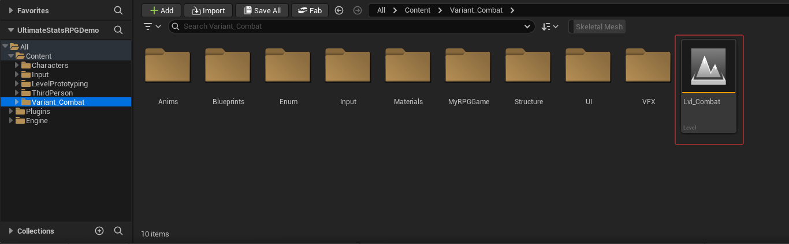

# Ultimate Stats Framework RPG Demo

An ongoing full RPG game project built with **Unreal Engine 5.7** and [Ultimate Stats Framework](https://www.fab.com/listings/311ce299-b6bf-49f0-a4f3-9b0165b6e674).

The project is being developed into a complete RPG game and will continue to grow over time. Its goal is to provide a cohesive, feature-rich gameplay foundation covering common RPG systems.

## Project Starting Point

All gameplay content for this demo begins in `Content/Variant_Combat`.

Open `Lvl_Combat` to launch the playable arena. The folders alongside it organize the demo's animations, character Blueprints, input assets, materials, RPG data, UI, and visual effects. This is the central location to explore, extend, and maintain the RPG demo.

## Development Principles

Blueprints will be developed using consistent conventions and established best practices to ensure maintainability, extensibility, and strong runtime performance as the project grows.

## Current Showcase

### Complete Demo Overview

### Chapter 4 — Equipment Systems

Chapter 4 adds configurable equipment, equipment-based stat modifiers, a level-scaling weapon Formula, inventory and equipment UI, and item tooltips.

## Project Roadmap

The project is developed as a step-by-step learning series, with each chapter adding a complete set of connected RPG systems.

- [x] **Chapter 1 — Stats, Formula, and Combat Foundation**
- [x] **Chapter 2 — Levels and Character Progression**
- [x] **Chapter 3 — Buffs and Skills**
- [x] **Chapter 4 — Equipment Systems**

## Planned Features

- Character attributes and derived stats
- Buffs, debuffs, and status effects
- Levels, experience, and character progression
- Combat and enemy interactions
- Skills and abilities
- Equipment and equipment-based stat changes
- Shops and item trading
- Quests and objectives
- Items, consumables, and inventory interactions
- Additional common RPG gameplay systems

## Requirements

- Unreal Engine 5.7

> **Note:** Ultimate Stats Framework is not included in this repository. Obtain and install it separately from Fab, enable it in Unreal Engine through **Edit → Plugins**, and restart the editor when prompted.

## Ultimate Stats Framework

Ultimate Stats Framework is available on Fab:

[Visit the Ultimate Stats Framework Fab page](https://www.fab.com/listings/311ce299-b6bf-49f0-a4f3-9b0165b6e674)

## License

This project is licensed under the [MIT License](LICENSE).
