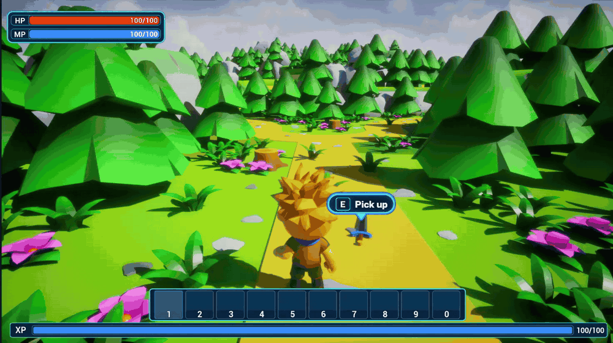

# Ultimate Stats Framework RPG Demo

An evolving RPG demo built with **Unreal Engine 5.7** and [Ultimate Stats Framework](https://www.fab.com/listings/311ce299-b6bf-49f0-a4f3-9b0165b6e674). The project demonstrates how to build connected RPG systems with the framework and serves as a starting point for further experimentation.

## Installing the Project

If you want to install this project, follow the [RPG Demo Project installation guide](https://roogame.gitbook.io/roogame/ultimate-stats-framework/installing-rpg-demo-project).

## Building a Complete RPG Game

This project will gradually evolve into a complete RPG game and aims to cover as many common RPG features as possible. For detailed, step-by-step development guides, see [Build a Complete RPG Game](https://roogame.gitbook.io/roogame/ultimate-stats-framework/build-a-complete-rpg-game).

## Current Features

This demo connects the framework's character stats, inventory, equipment, and world interactions into a playable RPG loop:

- **Complete attribute system:** The player has HP and MP attributes alongside stats such as Max HP, Max MP, Attack, Defense, Level, and MP Regeneration. The attribute panel displays the character's current values, while the in-game HUD keeps HP, MP, and EXP visible during play.
- **Inventory system and equipment:** A grid-based backpack and equipment slots let you organize items through drag-and-drop. The inventory, equipment panel, and hotbar share the same item data, so moving an item between them changes where it is held rather than creating a separate copy.
- **Pickups and interaction:** A sword exists as an item in the game world. Looking at it shows an interaction prompt, and pressing **E** picks it up through the framework's pickup system.
- **A sword with a stat bonus:** Equipping the sword grants **+5 Attack**. Its visual representation is attached to the character using sockets, connecting the equipped item to what you see on the player.
- **Ten-slot hotbar:** Items can be moved into the hotbar and selected with the **1–9** and **0** keys. The UI shows each slot's item and its selected state.
- **Third-person gameplay:** Character movement, animation, and a third-person camera provide a playable setting for these systems.

## Gameplay Preview

The first 13 seconds of the gameplay recording show the sword pickup prompt, backpack and equipment panels, player attributes, and hotbar selection.

## Free Third-Party Assets

This project includes free character and environment assets by **Dungeon Mason**, including *RPG Hero Squad PBR Polyart* and *RPG Tiny Fantasy Forest*. If you enjoy these assets or want to use them in your own project, you can obtain them and explore more of the creator's work on the [Dungeon Mason Fab store](https://www.fab.com/sellers/Dungeon%20Mason).
